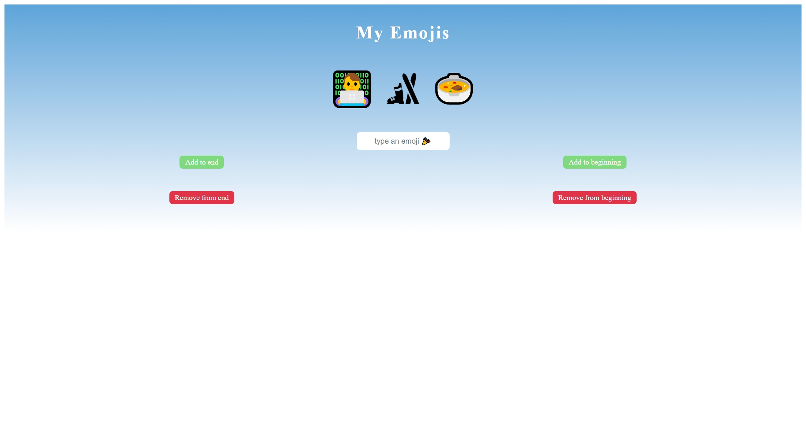

# Scrimba - The Frontend Developer Career Path - Module 3 - Your personality in emojis

This is a solution to the [Scrimba - The Frontend Developer Career Path - Module 3 - Your personality in emojis](https://scrimba.com/playlist/pbqMJu9). 

## About Scrimba

At Scrimba our goal is to create the best possible coding school at the cost of a gym membership! 💜
If we succeed with this, it will give anyone who wants to become a software developer a realistic shot at succeeding, regardless of where they live and the size of their wallets 🎉
The Frontend Developer Career Path aims to teach you everything you need to become a Junior Developer, or you could take a deep-dive with one of our advanced courses 🚀

## Table of contents

- [Scrimba - The Frontend Developer Career Path - Module 3 - Your personality in emojis](#scrimba---the-frontend-developer-career-path---module-3---your-personality-in-emojis)
  - [About Scrimba](#about-scrimba)
  - [Table of contents](#table-of-contents)
  - [Overview](#overview)
    - [The challenge](#the-challenge)
    - [Screenshot](#screenshot)
    - [Links](#links)
  - [My process](#my-process)
    - [Built with](#built-with)
    - [What I learned](#what-i-learned)
    - [Continued development](#continued-development)
  - [Author](#author)

## Overview

### The challenge

Create an app where you can add and remove emojis as you please.

### Screenshot

### Links

- Solution URL: [Github](https://github.com/varonalearns/My-Emojis)
- Live Site URL: [Netlify Live Site](https://courageous-babka-4072c8.netlify.app/)

## My process

### Built with

- Semantic HTML5 markup
- CSS custom properties

### What I learned

While working in this mini-project along with the instructor, I reinforced what I learned with JavaScript so far:
- Pushing and popping from an array
- addEventListener to buttons
- Grabbing elements from the DOM

### Continued development

In the future, I want to come back to this project and do the following:
- Add new features
- Refactor JavaScript
- Redesign the app and make it mobile-friendly

## Author

- Website - [Evalia Varona](https://www.evaliavarona.com)
- Hashnode - [@evavarona](https://evaliavarona.hashnode.dev)
